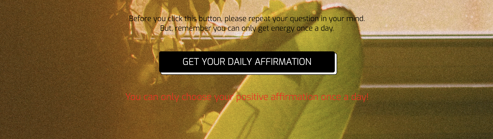

## Daily Affirmation

# Inspiration
There's real power in positive thinking — and that's a fact backed by science. 
Practicing self-affirmation regularly can actually reduce stress levels and set up successful outcomes in the real world.
I got inspired by the daily affirmation video on youtube and created this website. 
(If you don't know what daily affirmation is, you can check this video here: [Daily Affirmation](https://www.youtube.com/watch?v=uT6ASPy2Dbs&t=164s))

# Short Introduction
This app project is a static website that made with HTML, CSS and JavaScript only. 
This is the first project I made during studying full-stack development in Codeacademy.

# Purpose of this app
The main purpose of the website is to provide a daily positive affirmation to the user based on their name and date of birth.
Users are recommended to post the sentence on a wall where they can see it frequently, or write it down at the top of their daily to-do list.
By doing so, they can get positive energy from their unconscious mind which will lead to a good result in their real life.

# How to start
Click the link to open the app.

# How to use
- Enter your name.
- Enter your date of birth.
- Get your daily affirmation!

# Important features
- The app provide a few options of background image and font. User can choose whichever they like. Options can be found by clicking the painting icon on the right-top of the page.
 
- User can only get one affirmation per day. When user try to get more affirmations, the warning sentence will pop out.
 

# What I learned from this project
-How to make website more interactive by using DOM and JavaScript. for example, using onclick function to display or hide setting component and using if condition to trigger warning sentence.
Responsive design on landsacpe and different type of mobile devices.

# Contributor
[Qiuyi Wang](https://github.com/qiuyi0907)